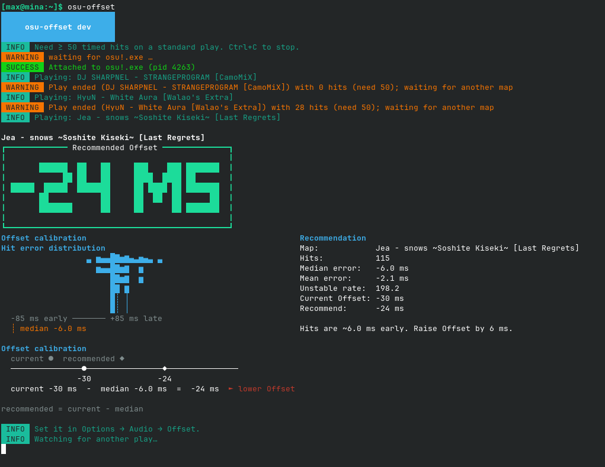

# osu-offset

Recommend a universal Offset for osu!stable from live hit error.

[](https://go.dev)
[](https://github.com/gaavin/offset-calc-osu-stable/releases)
[](https://nixos.org)

Attaches to `osu!.exe` (Windows, or Wine on Linux), reads the current play’s hit errors and Offset from memory, and prints `recommended = current − median` after each standard play with at least 50 timed hits. On Wine, audio is usually late, so the suggestion is often negative.

```bash
osu-offset
```

Play a map, then set **Options → Audio → Offset** to the printed value. Replay watching is ignored.



| Flag | Default | Meaning |
| --- | --- | --- |
| `-min-hits` | 50 | Min timed hits before recommending |
| `-watch` | on | Keep monitoring after each play |
| `-once` | off | Exit after the first usable play |
| `-poll` | 50ms | Memory sample interval |
| `-json` | off | Machine-readable output |

## Install

### Nix

```bash
nix run github:gaavin/offset-calc-osu-stable
```

Or add to Home Manager:

```nix
# flake inputs
offset-calc-osu-stable.url = "github:gaavin/offset-calc-osu-stable";

# home.nix
home.packages = [
  offset-calc-osu-stable.packages.${pkgs.stdenv.hostPlatform.system}.osu-offset
];
```

### With nix-osu-stable

```nix
programs.osu-stable = {
  enable = true;
  offsetCalculator.enable = true;
};
```

Then run `osu-offset` alongside `osu-wine`. See the [nix-osu-stable README](https://github.com/gaavin/nix-osu-stable#-essential-set-audio-offset) for the usual −40 to −35 ms Wine ballpark.

### Release binaries

Pushes to `master` that change Go source or modules publish a GitHub Release tagged `vYYYY-MM-DD-HHMMSS` (UTC commit time). Docs, assets, and other non-binary paths are skipped. Tags and assets are never overwritten.

Download from the [latest release](https://github.com/gaavin/offset-calc-osu-stable/releases):

| Platform | Artifact |
| --- | --- |
| Windows | `osu-offset-windows-amd64.exe`, `osu-offset-windows-arm64.exe` |
| Linux | `osu-offset-linux-amd64`, `osu-offset-linux-arm64` |

```bash
chmod +x osu-offset-linux-amd64
./osu-offset-linux-amd64
```

### From source

```bash
go build -o osu-offset ./cmd/osu-offset

GOOS=windows GOARCH=amd64 go build -o osu-offset.exe ./cmd/osu-offset
GOOS=linux   GOARCH=arm64 go build -o osu-offset ./cmd/osu-offset
```

Cross-compiles use `CGO_ENABLED=0`.

## Troubleshooting

| Issue | Solution |
| --- | --- |
| Hits feel late on Wine | Run `osu-offset` while you play; set the printed Offset (often negative) |
| "Waiting for osu!.exe" | Start the game, or launch `osu-offset` first — it attaches when osu! appears |
| Not enough hits | Play a longer standard map (≥ 50 timed hits) |
| Attach fails on Linux | Run as the same user as the game; try `kernel.yama.ptrace_scope=0` |
| Recommendation stops after game update | Signatures may have moved; file an issue with your osu! version |

Signatures match current osu!stable (same family as [tosu](https://github.com/tosuapp/tosu) / gosumemory).

## Related

- [nix-osu-stable](https://github.com/gaavin/nix-osu-stable) — osu! on NixOS with Wine + Steam Runtime
- [osu-winello](https://github.com/NelloKudo/osu-winello) — upstream Wine stack
- [tosu](https://github.com/tosuapp/tosu) — memory signature reference
